# TaxiVillage Database ER Diagram

Ниже актуальная ER-диаграмма по Prisma-схеме из [schema.prisma]

## Domain Summary

- `User` - базовая учетная запись, от которой отходят профили пассажира, водителя и merchant.
- `PassengerProfile` - пассажирские сущности: такси, курьер, еда, межгород, избранные адреса.
- `DriverProfile` - водительские сущности: авто, документы, поездки, курьерские заказы, межгородние заявки и рейсы.
- `Merchant` - заведение, меню и food-order flow.
- `Ride`, `CourierOrder`, `FoodOrder`, `IntercityOrder`, `IntercityTrip`, `IntercityBooking` - основные бизнес-сущности по вертикалям продукта.
- `ChatMessage` - общий слой сообщений для taxi/intercity threads.
- `PhoneOtpSession` - OTP-подтверждение номера через Telegram.

## ER Diagram

```mermaid
erDiagram
    User ||--o| PassengerProfile : has
    User ||--o| DriverProfile : has
    User ||--o| Merchant : has
    User ||--o{ ChatMessage : sends
    User ||--o{ ChatMessage : receives

    User {
      string id PK
      string phone UK
      string email UK
      string password
      datetime phoneVerifiedAt
      string refreshTokenHash
      string pushToken
      string avatarUrl
      boolean isDeleted
      datetime deletedAt
      enum role
      datetime createdAt
      datetime updatedAt
    }

    PhoneOtpSession {
      string id PK
      string phone
      string code
      datetime expiresAt
      int attempts
      datetime usedAt
      datetime verifiedAt
      string verificationToken UK
      string telegramChatId
      datetime telegramDeliveredAt
      enum channel
      enum purpose
      json payload
      datetime createdAt
      datetime updatedAt
    }

    PassengerProfile ||--o{ Ride : creates
    PassengerProfile ||--o{ CourierOrder : creates
    PassengerProfile ||--o{ FoodOrder : creates
    PassengerProfile ||--o{ IntercityOrder : creates
    PassengerProfile ||--o{ IntercityBooking : books
    PassengerProfile ||--o{ FavoriteAddress : saves

    PassengerProfile {
      string id PK
      string userId UK,FK
      string fullName
    }

    DriverProfile ||--o| Car : owns
    DriverProfile ||--o{ DriverDocument : uploads
    DriverProfile ||--o{ Ride : takes
    DriverProfile ||--o{ CourierOrder : takes
    DriverProfile ||--o{ IntercityOrder : accepts
    DriverProfile ||--o{ IntercityTrip : publishes

    DriverProfile {
      string id PK
      string userId UK,FK
      string fullName
      enum status
      boolean isOnline
      boolean supportsTaxi
      boolean supportsCourier
      boolean supportsIntercity
      enum driverMode
      enum courierTransportType
      float lat
      float lng
      datetime lastRideFinishedAt
      datetime lastCourierOrderFinishedAt
      decimal balance
      float rating
    }

    Merchant ||--o{ MenuCategory : owns
    Merchant ||--o{ FoodOrder : receives

    Merchant {
      string id PK
      string userId UK,FK
      string name
      string whatsAppPhone
      string cuisine
      string description
      int etaMinutes
      decimal minOrder
      float rating
      boolean isOpen
      string tone
      string coverImageUrl
    }

    Car {
      string id PK
      string driverId UK,FK
      string make
      string model
      string color
      string plateNumber
    }

    DriverDocument {
      string id PK
      string driverId FK
      enum type
      string url
      datetime uploadedAt
      boolean approved
    }

    Tariff ||--o{ Ride : prices

    Tariff {
      string id PK
      string name
      decimal baseFare
      decimal pricePerKm
      decimal pricePerMinute
      int systemCommissionPercent
      boolean isActive
    }

    Ride ||--o{ RideStop : has
    Ride ||--o{ RideStatusHistory : tracks
    Ride ||--o{ ChatMessage : thread

    Ride {
      string id PK
      string passengerId FK
      string driverId FK
      string tariffId FK
      enum status
      enum paymentMethod
      string fromAddress
      float fromLat
      float fromLng
      enum pickupLocationPrecision
      string toAddress
      float toLat
      float toLng
      enum dropoffLocationPrecision
      string comment
      decimal estimatedPrice
      decimal finalPrice
      datetime startedAt
      datetime finishedAt
      decimal commissionAmount
      int driverRating
      datetime createdAt
      datetime updatedAt
    }

    RideStop {
      string id PK
      string rideId FK
      string address
      float lat
      float lng
      datetime createdAt
    }

    RideStatusHistory {
      string id PK
      string rideId FK
      enum status
      datetime createdAt
    }

    CourierOrder ||--o{ CourierOrderStatusHistory : tracks

    CourierOrder {
      string id PK
      string passengerId FK
      string courierId FK
      enum status
      enum paymentMethod
      string pickupAddress
      float pickupLat
      float pickupLng
      string dropoffAddress
      float dropoffLat
      float dropoffLng
      string itemDescription
      string packageWeight
      string packageSize
      string comment
      decimal estimatedPrice
      decimal finalPrice
      datetime arrivedAt
      datetime pickedUpAt
      datetime deliveredAt
      datetime createdAt
      datetime updatedAt
    }

    CourierOrderStatusHistory {
      string id PK
      string courierOrderId FK
      enum status
      datetime createdAt
    }

    MenuCategory ||--o{ MenuItem : contains

    MenuCategory {
      string id PK
      string merchantId FK
      string name
      int sortOrder
    }

    MenuItem ||--o{ FoodOrderItem : appears_in

    MenuItem {
      string id PK
      string categoryId FK
      string name
      int sortOrder
      string description
      decimal price
      boolean isAvailable
      string imageUrl
    }

    FoodOrder ||--o{ FoodOrderItem : has
    FoodOrder ||--o{ FoodOrderStatusHistory : tracks

    FoodOrder {
      string id PK
      string passengerId FK
      string merchantId FK
      enum status
      string deliveryAddress
      string comment
      enum paymentMethod
      decimal totalPrice
      datetime createdAt
      datetime updatedAt
    }

    FoodOrderItem {
      string id PK
      string foodOrderId FK
      string menuItemId FK
      string name
      decimal price
      int qty
    }

    FoodOrderStatusHistory {
      string id PK
      string foodOrderId FK
      enum status
      datetime createdAt
    }

    IntercityOrder ||--o{ IntercityOrderStatusHistory : tracks
    IntercityOrder ||--o{ ChatMessage : thread
    IntercityOrder ||--o{ IntercityTripInvite : receives

    IntercityOrder {
      string id PK
      string passengerId FK
      string driverId FK
      enum status
      enum paymentMethod
      string fromCity
      string toCity
      datetime departureAt
      int seats
      string baggage
      string comment
      decimal price
      json stops
      boolean womenOnly
      boolean baggageRequired
      boolean noAnimals
      datetime createdAt
      datetime updatedAt
    }

    IntercityOrderStatusHistory {
      string id PK
      string intercityOrderId FK
      enum status
      datetime createdAt
    }

    IntercityTrip ||--o{ IntercityBooking : has
    IntercityTrip ||--o{ IntercityTripStatusHistory : tracks
    IntercityTrip ||--o{ ChatMessage : group_thread
    IntercityTrip ||--o{ IntercityTripInvite : sends

    IntercityTrip {
      string id PK
      string driverId FK
      string fromCity
      string toCity
      datetime departureAt
      decimal pricePerSeat
      int seatCapacity
      string comment
      json stops
      boolean womenOnly
      boolean baggageSpace
      boolean allowAnimals
      string carMake
      string carModel
      string carColor
      string plateNumber
      enum status
      datetime createdAt
      datetime updatedAt
    }

    IntercityBooking ||--o{ ChatMessage : thread

    IntercityBooking {
      string id PK
      string tripId FK
      string passengerId FK
      enum bookingType
      int seatsBooked
      decimal totalPrice
      string comment
      enum status
      datetime createdAt
      datetime updatedAt
    }

    IntercityTripInvite {
      string id PK
      string tripId FK
      string orderId FK
      enum status
      int seatsOffered
      decimal priceOffered
      string message
      datetime respondedAt
      datetime createdAt
      datetime updatedAt
    }

    IntercityTripStatusHistory {
      string id PK
      string intercityTripId FK
      enum status
      datetime createdAt
    }

    FavoriteAddress {
      string id PK
      string passengerId FK
      string name
      string address
      float lat
      float lng
      datetime createdAt
      datetime updatedAt
    }

    ChatMessage {
      string id PK
      datetime createdAt
      datetime readAt
      string messageGroupId
      string rideId FK
      string intercityOrderId FK
      string intercityBookingId FK
      string intercityTripId FK
      string senderUserId FK
      string receiverUserId FK
      enum senderType
      enum receiverType
      string content
    }
```

## Notes For Review

- Модель построена вокруг единого `User`, а доменные профили разделены по ролям: `PassengerProfile`, `DriverProfile`, `Merchant`.
- Для каждой продуктовой вертикали есть отдельная основная сущность и отдельная история статусов:
  - taxi: `Ride` + `RideStatusHistory`
  - courier: `CourierOrder` + `CourierOrderStatusHistory`
  - food: `FoodOrder` + `FoodOrderStatusHistory`
  - intercity request flow: `IntercityOrder` + `IntercityOrderStatusHistory`
  - intercity trip flow: `IntercityTrip` + `IntercityTripStatusHistory`
- Межгород разделен на 3 слоя:
  - `IntercityOrder` - запрос пассажира
  - `IntercityTrip` - опубликованный рейс водителя
  - `IntercityBooking` - подтвержденное место пассажира в рейсе
- `IntercityTripInvite` связывает пассажирские заявки с рейсами водителей без мгновенного создания брони.
- `ChatMessage` используется как общий механизм для taxi и intercity threads.
- `PhoneOtpSession` закрывает новый auth flow с подтверждением номера по Telegram OTP.

